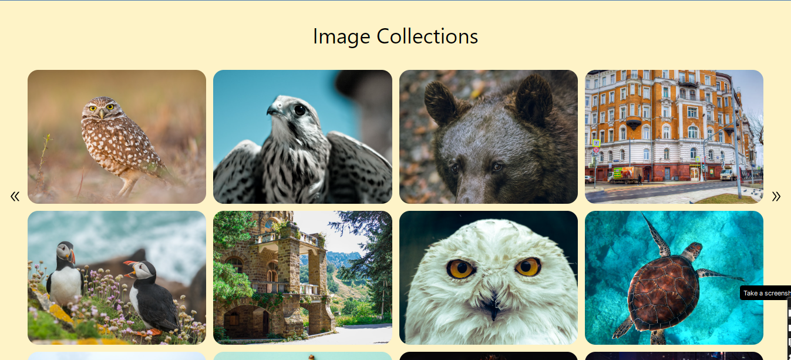
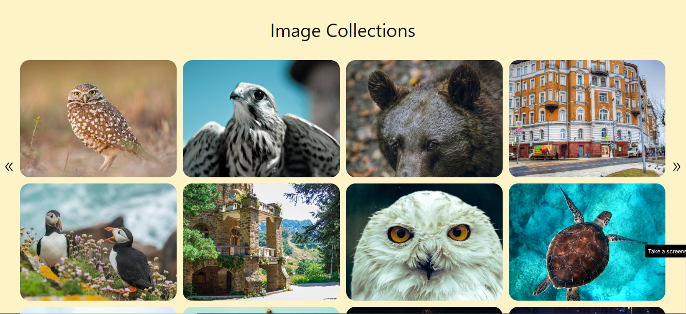
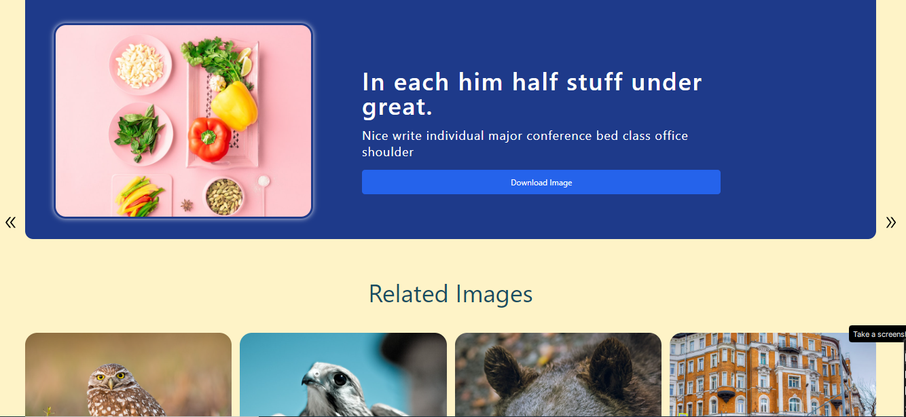

# Image Universe WebApp

Welcome to the Image Universe app! This readme will guide you through everything you need to know about running, building, and understanding the app. This app is built using React Vite and Tailwind CSS, and it offers a responsive user experience. Users can view image details, download images, and explore related images. They can also navigate through a collection of images using the previous and next icons.

## Table of Contents

- [Introduction](#introduction)
- [Folder Structure](#folder-structure)
- [Getting Started](#getting-started)
  - [Prerequisites](#prerequisites)
  - [Installation](#installation)
- [Technologies Used](#technologies-used)
- [App Features](#app-features)
  - [View Image Details](#view-image-details)
  - [Download Images](#download-images)
  - [Responsive Design](#responsive-design)
  - [Explore Related Images](#explore-related-images)
  - [Navigate Through Images](#navigate-through-images)
  - [ API Usage]
  (# API Usage)
- [Contributing and Contact](#contributing-and-contact)

## Introduction

The Image Universe app is a responsive web application that enables users to explore a universe of images. It's built using React Vite for fast development and Tailwind CSS for styling, ensuring a modern and user-friendly interface.

## Folder Structure

Here is the folder structure of the app:

image-universe-app/
|-- public/
|-- src/
| |-- Components/
| | |-- ImageCards.jsx
| | |-- ImageCardDetails.jsx
| | |-- Image.jsx
| |-- utils/
| | |-- fetchData.js
| | |-- fetchDataDetails.js
| |-- App.jsx
| |-- index.css
| |-- main.jsx
|-- favicon.ico
|-- index.html
|-- README.md

## Getting Started

### Prerequisites

- Node.js (v14 or higher)
- npm (v6 or higher)

### Installation

To run the app locally, follow these steps:

1. Clone this repository.
2. Navigate to the project directory: `cd image-universe-app`.
3. Install dependencies: `npm install`.
4. Start the development server: `npm run dev`.

The app will open in your default web browser at `http://localhost:3000`.

## Technologies Used

The Image Universe app leverages the following technologies:

- React Vite: A fast development environment for building React applications.
- Tailwind CSS: A utility-first CSS framework for styling.
- React Router: Handles routing within the app.
- Axios: A promise-based HTTP client for making API requests.

## App Features

### View Image Details

Users can click on any image to view its detailed information, including the image title and description. This allows users to learn more about the images they're interested in.

### Download Images

The app enables users to download images directly from the image details page. A download button is provided that, when clicked, triggers the download of the image in JPG format.

### Responsive Design

The app is designed to be responsive, ensuring a seamless experience across various devices and screen sizes. Whether on a desktop, tablet, or smartphone, users can enjoy the app's features without any issues.

### Explore Related Images

Below the image details section, users can explore related images that are associated with the current image. This provides a convenient way for users to discover more images in the same theme or category.

### Navigate Through Images

The app includes navigation controls to help users move through the collection of images. The previous and next icons allow users to easily access adjacent images without returning to the main grid.

## API Usage

The Image Universe app fetches image data from the API provided by [ScreenRec](https://screenrec.com/). This API allows the app to retrieve image information and provide users with a diverse collection of images to explore. The fetched data includes image URLs, titles, descriptions, and more.

To ensure a dynamic and engaging user experience, the app leverages the API to display a wide range of images for users to enjoy.

## Contributing and Contact

We welcome contributions from the community to make the Image Universe app even better! If you have ideas, improvements, or bug fixes, please feel free to submit a pull request. Your contributions are greatly appreciated and help enhance the app for everyone.

Additionally, if you'd like to connect or have any questions, you can find us on LinkedIn. Feel free to reach out to us at [linkedin.com/in/rishabh6306](https://www.linkedin.com/in/rishabh6306). We're always excited to connect with fellow developers and collaborate.

Thank you for taking the time to explore and read through this readme. Your interest and support mean a lot to us. Happy coding and contributing!